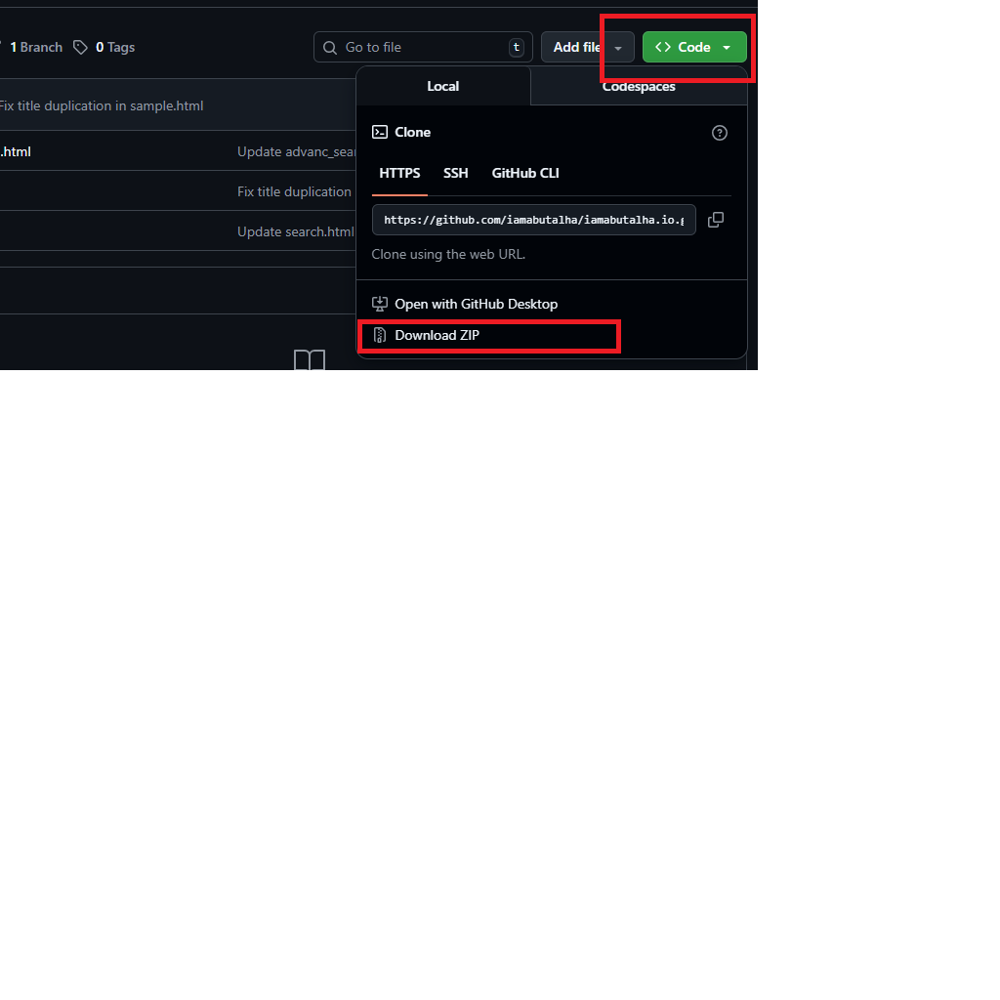

# README

## How to Download

Follow these steps to download this code:



## Clone the Repository

```bash
git clone <your-repo-url>
cd <repo-name>
```

## Installation

1. Ensure you have Python installed
2. Install dependencies: `pip install -r requirements.txt`
3. Run the project

## Usage

Add your usage instructions here.
